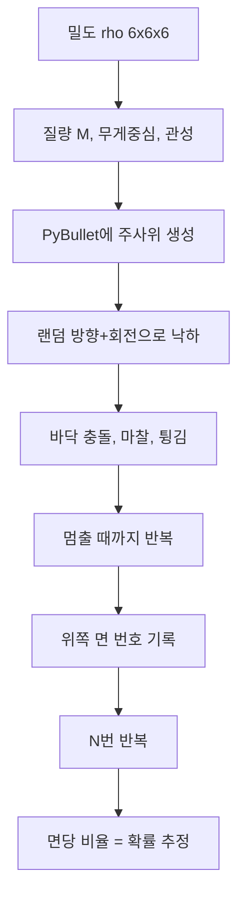

# 주사위 시뮬레이션 — 물리·수학·코드 쉬운 설명

> **대상:** 고등학교 물리·미적분을 배운 학생  
> **목표:** 어려운 용어를 풀어 쓰고, 수식·코드·직관을 함께 이해하기

---

## 용어 사전 (먼저 읽어보세요)

| 용어 | 쉬운 뜻 |
|------|---------|
| **밀도 $\rho$** | 단위 부피당 질량. “이 칸이 얼마나 꽉 찼는가” |
| **무게중심 (COM)** | 질량이 한 점에 모여 있다고 생각했을 때 그 점의 위치. 저울 위에 올렸을 때 **균형이 잡히는 점** |
| **관성 모멘트 $I$** | 물체가 **얼마나 돌리기 어려운지**. 질량이 중심에서 멀수록 크다 |
| **토크 $\boldsymbol{\tau}$** | 회전시키는 힘. 문손잡이를 돌릴 때 손에 가는 “비틀리는 힘” |
| **각속도 $\boldsymbol{\omega}$** | 얼마나 빠르게 도는지 (rad/s). 초당 몇 라디안 회전 |
| **강체** | 모양이 변하지 않는 물체. 주사위는 눌려 뭉개지지 않는다고 가정 |
| **쿼터니언** | 3차원 회전을 숫자 4개로 저장하는 방법. PyBullet·코드에서 자세 표현에 사용 |
| **몬테카를로** | 컴퓨터로 같은 실험을 **엄청 많이 반복**해서 확률을 추정하는 방법 |
| **PyBullet** | 물리 엔진. 중력·충돌·마찰을 컴퓨터가 대신 계산해 줌 |
| **$\Delta t$** | 시뮬레이션에서 **한 번에 진행하는 시간** (우리: 1/240초) |
| **반발 계수 $e$** | 튕김 정도. 0이면 안 튕김, 1이면 완전 탄성 충돌 |
| **마찰 계수 $\mu$** | 미끄러지기 어려운 정도. 클수록 잘 굴러가다 멈춤 |
| **표준오차 (SE)** | “몇 번 반복했을 때 결과가 진짜 값에서 얼마나 흔들리는지”의 대략적 크기 |

---

## 0. 우리가 풀려는 문제

### 무엇을 구하나?

주사위를 떨어뜨렸을 때 **위쪽에 오는 면**이 1, 2, 3, 4, 5, 6 중 무엇인지.

각 면 $k$가 나올 **진짜 확률**을 $p_k$라고 씁니다:

$$
p_k = \text{“위쪽 면이 } k \text{번일 확률”}
$$

예: $p_1 = 0.2$ 이면 20% 확률로 1번 면이 위를 향한다는 뜻.

### 밀도 $\rho$는 왜 들어가나?

주사위 안이 **골고루** 무거우면 공정한 주사위, **한쪽만** 무거우면 불공정해집니다.

- $\rho(x,y,z)$ = 좌표 $(x,y,z)$에서의 밀도
- 코드에서는 주사위를 **6×6×6 = 216개 작은 상자**로 나누고, 각 칸에 $\rho$ 값을 저장 (`density/grid.py`)

### 질량과 무게중심 (적분 → 격자 합)

연속적으로 쓰면:

$$
M = \int \rho \, dV, \qquad
\mathbf{r}_{\mathrm{cm}} = \frac{1}{M}\int \rho \,\mathbf{r}\, dV
$$

**말로 풀면:**
- $M$: 전체 질량 = “각 칸 질량을 전부 더한 것”
- $\mathbf{r}_{\mathrm{cm}}$: 무게중심 = “각 칸 질량 × 그 칸 위치”를 더한 뒤, 전체 질량으로 나눈 것

코드에서는 적분 대신 **더하기**로 근사합니다 (리만 합):

$$
M \approx \sum_{i,j,k} \rho_{ijk} \times (\text{한 칸 부피})
$$

> **비유:** 케이크를 216조각으로 자르고, 조각마다 무게를 재서 “진짜 무게 중심이 어디인지” 구하는 것.

---

## 1. 무게중심이 확률을 바꾸는 이유

### 1.1 왜 무게중심이 중요한가?

균일한 주사위: 무게중심 = 기하학적 정중앙 (원점).

한쪽이 무거운 주사위: 무게중심이 **무거운 쪽으로 치우침**.

바닥에 놓인 주사위는 **무거운 쪽이 아래로** 가려 합니다.  
그래서 “어느 면이 위로 오는가”의 확률이 달라집니다.

### 1.2 힘과 회전 — 고등학교 물리 복습

**이동 (병진):** 뉴턴 2법칙

$$
M \times \text{(가속도)} = \text{받는 힘의 합}
$$

주사위에 작용하는 힘:
- **중력** $M\mathbf{g}$ (아래로)
- **바닥 반력** (충돌할 때 위로)

**회전:** 회전에 대한 뉴턴 2법칙

$$
\mathbf{I} \times \text{(각가속도)} = \text{토크의 합}
$$

- $\mathbf{I}$: 관성 모멘트 (돌리기 어려운 정도)
- **토크**: 회전을 일으키는 힘 (지레-arm $\times$ 힘)

### 1.3 중력이 회전을 만드는 조건

중력은 전체적으로 아래로 당기지만, **무게중심이 중심에서 벗어나 있으면** 주사위를 기울이는 **토크**가 생깁니다:

$$
\boldsymbol{\tau}_{\mathrm{grav}} = \mathbf{r}_{\mathrm{cm}} \times (M\mathbf{g})
$$

**$\times$는 외적** — 두 벡터가 이루는 “비틀림”의 크기.

- $\mathbf{r}_{\mathrm{cm}} = 0$ (균일) → 토크 = 0 → 중력만 보면 어느 면이 위든 **대칭**
- $\mathbf{r}_{\mathrm{cm}} \neq 0$ → 자세마다 토크가 다름 → **어떤 면이 위로 오기 쉬운지** 달라짐

### 1.4 위치 에너지 — “무거운 쪽이 아래”

무게중심의 높이를 $z_{\mathrm{cm}}$이라 하면, 중력 위치 에너지:

$$
U = M g \, z_{\mathrm{cm}}
$$

$z_{\mathrm{cm}}$이 **낮을수록** 에너지가 작고 **안정적**입니다.

| 경우 | 결과 |
|------|------|
| 균일 주사위 | 6가지 “면이 바닥” 자세에서 $z_{\mathrm{cm}}$ 같음 → 6면 대칭 → $p_k \approx 1/6$ |
| 비균일 주사위 | 자세마다 $z_{\mathrm{cm}}$ 다름 → 어떤 면이 위로 오기 **쉬운** 자세가 생김 |

### 1.5 안정·불안정 (직관)

공을 언덕 위에 올리면 굴러떨어집니다 → **불안정**  
공을 골짜기 바닥에 두면 가만히 있습니다 → **안정**

주사위도 멈춘 자세마다 “살짝 밀었을 때 더 안정적인지”가 다릅니다.  
비균일하면 **안정적인 자세**로 끌려 들어가는 비율이 달라져 확률이 바뀝니다.

### 1.6 코드: 위쪽 면은 어떻게 정하나? (`physics/faces.py`)

주사위가 멈추면, 6개 면 각각에 **바깥을 향하는 화살표(법선)** 가 있습니다.

예: 윗면은 $(0,0,1)$ 방향.

회전 후 이 화살표들을 월드 좌표로 돌려 보고, **위쪽 $(0,0,1)$과 가장 비슷한 방향**인 면이 결과입니다.

```python
# 의사 코드
for 각 면의 법선 n:
    world_n = 회전행렬 × n
    if world_n · (0,0,1) 이 가장 크면:
        그 면 번호가 결과
```

### 1.7 한 가지 주의

실제 확률 $p_k$는 **에너지만**으로 결정되지 않습니다.

- 처음에 **얼마나 빙글빙글 도는지** (`MAX_ANGULAR_VEL = 5`)
- **얼마나 높이에서 떨어뜨리는지** (`DROP_HEIGHT = 1.5` m)
- **바닥 마찰** (`FRICTION = 0.5`), **튕김** (`RESTITUTION = 0.3`)

까지 모두 포함한 **전체 시뮬레이션 결과**입니다.

---

## 2. PyBullet이 매 순간 하는 일

### 2.1 큰 그림

실제 물리는 **연속적인 시간**에서 일어납니다.  
컴퓨터는 시간을 **아주 짧은 조각** $\Delta t = 1/240$초씩 나눠서 계산합니다.

매 조각마다:
1. 중력으로 속도·위치 갱신
2. 바닥과 부딪혔는지 확인
3. 부딪혔으면 튕기고, 마찰로 속도 줄이기
4. 다음 조각으로

이걸 `p.stepSimulation()` 한 번이 담당합니다 (`simulation/single_trial.py`).

### 2.2 왜 1/240초인가?

너무 큰 $\Delta t$ → 한 번에 너무 많이 움직여서 **바닥을 뚫고 들어가는** 등 부정확  
너무 작은 $\Delta t$ → 정확하지만 **느림**

낙하 최대 속도 대략 $\sqrt{2gh} \approx 5.4\,\mathrm{m/s}$ 일 때,  
한 스텝 이동 $\approx 5.4/240 \approx 2.2\,\mathrm{cm}$ → 주사위(1 m)에 비해 충분히 작음.

### 2.3 충돌 때 일어나는 일

**법선 방향 (바닥에 수직):**

$$
v_{\text{충돌 후}} = -e \times v_{\text{충돌 전}}
$$

$e = 0.3$ (`RESTITUTION`) → 속도의 30%만 반대 방향으로 (에너지 손실, 덜 튕김).

**접선 방향 (미끄러지는 방향):**  
마찰 $\mu = 0.5$ (`FRICTION`)가 미끄러짐을 줄여 **굴러가다 멈추게** 합니다.

### 2.4 한 번 던지기의 순서 (`simulation/single_trial.py`)

| 순서 | 하는 일 | 설정값 |
|------|---------|--------|
| 1 | PyBullet 연결 (화면 없음) | `p.DIRECT` |
| 2 | 바닥 + 주사위 생성 | `physics/bodies.py` |
| 3 | 높이 1.5 m, **랜덤 방향**, **랜덤 회전**으로 시작 | `DROP_HEIGHT`, 쿼터니언 |
| 4 | `stepSimulation()` 반복 (최대 2400번 ≈ 10초) | `MAX_SIM_STEPS` |
| 5 | 속도·회전이 충분히 작으면 “멈춤” | `VEL_THRESHOLD`, `ANG_VEL_THRESHOLD` |
| 6 | 위쪽 면 번호 반환 | `get_top_face()` |

### 2.5 비균일 밀도를 PyBullet에 넣는 방법 (`physics/bodies.py`)

216개 작은 상자를 각각 만들 수도 있지만 **느립니다**.

대신:
1. `physics/inertia.py`에서 **총 질량 $M$**, **무게중심**, **관성 모멘트**를 미리 계산
2. **모양은 1개의 큰 정육면체**로 두고, “무게중심이 어디인지”“얼마나 돌리기 어려운지”만 PyBullet에 알려 줌

```python
# bodies.py가 하는 일 (쉬운 설명)
createMultiBody(
    mass = M,                          # 총 질량
    inertialFramePosition = r_cm,      # 무게중심 위치
    localInertiaDiagonal = [I1,I2,I3]  # 돌리기 어려운 정도
)
```

### 2.6 관성 계산 (`physics/inertia.py`)

각 격자 칸을 **작은 점질량**으로 보고:

- 질량 $m_i = \rho_i \times \text{칸 부피}$
- 무게중심: 질량 가중 평균 위치
- 관성: “중심에서 얼마나 떨어져 있느냐”로 돌리기 어려움 계산

균일 밀도 검증: 무게중심 $\approx (0,0,0)$, `step2_test_inertia.py`로 확인.

---

## 3. 몬테카를로 — 5만 번 반복하면 얼마나 맞나?

### 3.1 기본 아이디어

진짜 확률 $p_k$는 **이론값**이고, 우리는 시뮬을 $N$번 해서 **비율** $\hat{p}_k$를 구합니다:

$$
\hat{p}_k = \frac{\text{면 } k \text{가 나온 횟수}}{N}
$$

**비유:** 동전을 1000번 던져 앞면 비율로 확률 추정하는 것과 같습니다.

### 3.2 왜 매번 결과가 다른가?

초기 방향·회전이 **랜덤**이기 때문입니다.  
200번만 하면 14%–20%처럼 **들쭉날쭉**해 보여도 정상입니다.

### 3.3 표준오차 — “대략 얼마나 흔들리나”

$$
\mathrm{SE} = \sqrt{\frac{p_k(1-p_k)}{N}}
$$

$p_k \approx 1/6$ 일 때:

$$
\mathrm{SE} \approx \sqrt{\frac{5}{36N}}
$$

| 시행 횟수 $N$ | 대략 SE | 의미 (대략) |
|---------------|---------|-------------|
| 200 | 2.6% | ±5% 정도 흔들림 |
| 5,000 | 0.5% | ±1% |
| **50,000** | **0.17%** | **±0.3%** |
| 500,000 | 0.05% | ±0.1% |

**규칙:** $N$을 **4배** 늘리면 오차는 **약 절반**이 됩니다.

### 3.4 50,000번이면?

$$
\mathrm{SE} \approx \sqrt{\frac{5}{36 \times 50000}} \approx 0.0017
$$

95% 신뢰구간 (대략):

$$
\hat{p}_k \pm 0.003 \quad \text{(약 ±0.3%p)}
$$

균일 주사위($p_k = 1/6 \approx 16.7\%$)라면, 시뮬 결과가 **16.4%–17.0%** 안에 들어올 가능성이 높습니다.

### 3.5 코드에서의 오차막대 (`main.py`)

그래프의 오차막대는 $\sqrt{\hat{p}(1-\hat{p})/N}$ — 위 SE의 추정치입니다.

### 3.6 두 가지 종류의 “틀림”

| 종류 | 뜻 | $N$을 늘리면? |
|------|-----|----------------|
| **통계적 오차** | 운 나쁘게 이번에만 편향됨 | 줄어듦 ($\propto 1/\sqrt{N}$) |
| **체계적 오차 (bias)** | 시뮬 설정 자체의 한계 | **안 줄어듦** |

체계적 오차 예:
- 6×6×6 격자가 거칠어서 $\rho$ 근사가 부정확
- $\Delta t = 1/240$이 커서 충돌 계산이 부정확
- “멈춤” 판정 기준이 애매함

그래서 $N \to \infty$로 해도 **완벽한 진짜 주사위**와는 약간 다를 수 있습니다.

---

## 4. 전체 흐름 (한눈에)



---

## 5. 코드 파일 — 각각 무슨 일을 하나?

| 파일 | 하는 일 (쉬운 말) |
|------|-------------------|
| `config.py` | 높이, 마찰, 튕김, 시간 간격 등 **설정 모음** |
| `density/grid.py` | 216칸 밀도 저장, 질량·무게중심 계산 |
| `density/analytic.py` | 함수 $\rho(x,y,z)$를 216칸 숫자로 바꿈 |
| `density/visualize.py` | 밀도를 3D 색깔로 보여 줌 (Plotly) |
| `physics/inertia.py` | 돌리기 어려운 정도(관성) 계산 |
| `physics/bodies.py` | PyBullet에 바닥·주사위 만들기 |
| `physics/faces.py` | 멈춘 뒤 **위쪽 면** 번호 알아내기 |
| `simulation/single_trial.py` | **1번** 던지기 시뮬 |
| `simulation/monte_carlo.py` | **N번** 반복 + 확률 계산 |
| `main.py` | 명령줄에서 전체 실행 |

### 실행 예시

```powershell
conda activate physics-prob-v2
cd c:\Users\codin\Documents\physics_prob_distribution_v2

# 1단계: 격자 확인
python step1_test_grid.py

# 1번만 던져 보기
python main.py --single-test

# 5만 번 시뮬
python main.py --rho uniform --trials 50000 --workers 4
```

---

## 6. 자주 묻는 질문

### Q. 주사위 크기 1 m면 숫자가 너무 작아지지 않나?

**오히려 반대입니다.** 1 m면 질량·관성이 커서 컴퓨터가 다루기 **안전**합니다.  
실제 크기(2 cm) 주사위가 수치적으로 더 까다롭습니다.

### Q. 균일 밀도면 정말 1/6인가?

이론적으로 거의 대칭입니다. 시뮬에서도 5만 번이면 각 면 **16.4%–17.0%** 근처에 모입니다.  
200번만 하면 14%–20%처럼 보여도 **표본이 적어서** 그런 것입니다.

### Q. PyBullet 안을 알아야 하나?

아니요. “중력·충돌·마찰을 대신 계산해 주는 상자”로 이해하면 됩니다.  
우리가 신경 쓰는 것은 **입력**(밀도, 초기 조건)과 **출력**(위쪽 면)입니다.

---

## 7. 수식만 모아본 요약 (복습용)

**질량·무게중심:**
$$
M \approx \sum \rho_{ijk}\,\Delta V, \qquad
\mathbf{r}_{\mathrm{cm}} \approx \frac{1}{M}\sum \rho_{ijk}\,\mathbf{r}_{ijk}\,\Delta V
$$

**중력 토크:**
$$
\boldsymbol{\tau} = \mathbf{r}_{\mathrm{cm}} \times (M\mathbf{g})
$$

**위치 에너지:**
$$
U = M g\, z_{\mathrm{cm}}
$$

**확률 추정:**
$$
\hat{p}_k = \frac{C_k}{N}, \qquad
\mathrm{SE} \approx \sqrt{\frac{p_k(1-p_k)}{N}}
$$

---

## 8. 더 배우고 싶다면 (심화)

- 균일 $\rho$에서 $p_k = 1/6$인 **대칭성** 증명
- 초기 조건 분포 → 최종 면 분포로 가는 **확률적 흐름**
- $\Delta t$, 격자 수를 바꿔 **체계적 오차** 줄이기

이 주제들은 시뮬 결과와 비교하는 **실험 과제**로 이어갈 수 있습니다.
